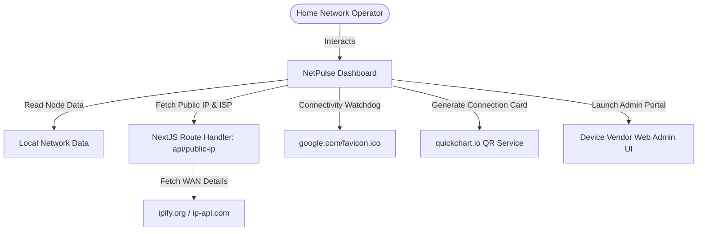

# ⚡ NetPulse Home

> **Private Home Infrastructure Dashboard & Latency Watchdog**

NetPulse Home is a modern, responsive network monitoring dashboard designed for local area networks. It provides real-time visualization of core network nodes (GPON, Router, Wi-Fi Extenders), integrates useful network diagnostics tools (Latency, Geolocation, Speed Tests), and offers quick launch paths to device management interfaces.

---

## 🚀 Core Features

- **Network Node Control**: Interactive, glassmorphism visualization of hardware nodes with active telemetry.
- **Diagnostics Dashboard**: Fast, integrated shortcuts to external tools for speed tests, ping latency, DNS leak testing, MAC address lookups, and geolocation.
- **Wi-Fi QR Access**: One-click dynamic QR code generation for instant mobile connections to network SSIDs.
- **Security credential vaults**: Secure client-side credential retrieval (username/password toggles) for local device portals.
- **Connectivity Heartbeat**: Automated, periodic active internet checking showing connection status, public IP address, IPv6 compatibility, and ISP network identity.

---

## 🗺️ System Architecture



---

## ⚙️ How to Edit Device Configurations & Dashboard Info

There are two levels of editing for devices in NetPulse:

### 🖥️ Modifying Dashboard Display Information
To change the device info displayed on the NetPulse dashboard itself (such as changing a device's name, description, IP address, MAC, or credentials), you must manually update the local dataset configuration file:

👉 **[network-data.ts](file://src/app/lib/network-data.ts)**

Inside this file, locate the `INITIAL_DEVICES` array and modify the fields (e.g. `name`, `ipAddress`, `manufacturer`, `username`, `adminPassword`, etc.) as needed.

### 🌐 Modifying Actual Physical Device Settings (SSID, Password, DHCP, etc.)
Since NetPulse is a local monitoring dashboard, **direct configuration changes to the hardware settings themselves take place on each vendor's web administration portal.**

Follow these steps to navigate to and log into a device's local admin GUI:

```
  ┌─────────────────────────────────────────────────────────────┐
  │ 1. Locate Device Card on NetPulse Dashboard                 │
  └──────────────────────────────┬──────────────────────────────┘
                                 ▼
  ┌─────────────────────────────────────────────────────────────┐
  │ 2. Click Information Icon (ⓘ) in Top-Right of Card          │
  └──────────────────────────────┬──────────────────────────────┘
                                 ▼
  ┌─────────────────────────────────────────────────────────────┐
  │ 3. Note down "Username" and Toggle-Eye for "Password"       │
  └──────────────────────────────┬──────────────────────────────┘
                                 ▼
  ┌─────────────────────────────────────────────────────────────┐
  │ 4. Click the Green "LAUNCH ADMIN" Button                    │
  └──────────────────────────────┬──────────────────────────────┘
                                 ▼
  ┌─────────────────────────────────────────────────────────────┐
  │ 5. Log in & Configure Wireless/System settings inside GUI    │
  └─────────────────────────────────────────────────────────────┘
```

### Detailed Walkthrough:

1. **Locate the Device**: Scroll through the **Network Node Control** section on the main dashboard to find the device you wish to modify (e.g., Nokia Home Gateway or OpenWrt Router).
2. **Access Credentials**:
   - Click the blue **Info (ⓘ)** icon in the top-right corner of the target device card.
   - The card will slide up to reveal technical specifications (manufacturer, hardware model, firmware, username, and password).
   - Click the **Eye Icon** next to the password field to decrypt and show the password. Note down both the **Username** and **Password**.
3. **Launch Admin Web GUI**:
   - Click the green **LAUNCH ADMIN** button at the bottom of the card.
   - This opens the local administration interface (e.g., Nokia's web GUI at `http://192.168.100.1` or OpenWrt's LuCI dashboard at `http://192.168.10.1`) in a new browser tab.
4. **Apply Modifications**:
   - Log in using the credentials retrieved in Step 2.
   - Navigate to the **Wireless Configuration** (for SSID/password changes) or **Network Interfaces** (for IP/DHCP changes) to make edits.

---

## 📂 Project Directory Structure

```text
NetPulse/
├── docs/                      # Technical specification blueprints
│   ├── backend.json           # Data schema specs
│   └── blueprint.md           # Product guidelines & style requirements
├── src/
│   ├── app/                   # Next.js Router files
│   │   ├── api/
│   │   │   └── public-ip/     # Route for checking public IP/ISP details
│   │   ├── globals.css        # Tailwind styling & glow animations
│   │   ├── layout.tsx         # Site viewport, metadata, and Toaster
│   │   └── page.tsx           # Dashboard main landing view
│   ├── components/            # React UI components
│   │   ├── ui/                # Core shadcn primitives
│   │   │   ├── toast.tsx
│   │   │   └── toaster.tsx
│   │   ├── BackgroundEffects.tsx  # Dynamic scanlines & radial neon sweeps
│   │   ├── Clock.tsx          # Real-time Technical status clock
│   │   ├── DeviceCard.tsx     # Device node card component
│   │   └── NetworkTools.tsx   # Diagnostic utilities
│   ├── hooks/                 # React state hooks
│   │   └── use-toast.ts
│   └── lib/                   # Utility helpers
│       └── utils.ts           # Classnames merging helper (cn)
├── tailwind.config.ts         # Neon palette & typography configuration
└── next.config.ts             # Next.js compiler preferences
```

---

## 🛠️ Local Development & Setup

### Prerequisites
- **Node.js** (v18.x or higher recommended)
- **npm** (or yarn/pnpm)

### 1. Installation
Clone the repository and install the dependencies:
```bash
npm install
```

### 2. Setup Local Environment
Ensure the environment variables are loaded by copying the example environment file:
```bash
cp .env.example .env.local
```

### 3. Run Development Server
Start the development server with Turbopack support (runs on port `9002`):
```bash
npm run dev
```
Open [http://localhost:9002](http://localhost:9002) in your browser to view the application.

### 4. Build for Production
To build the static application bundle:
```bash
npm run build
```
Verify files are optimized and compile correctly.
